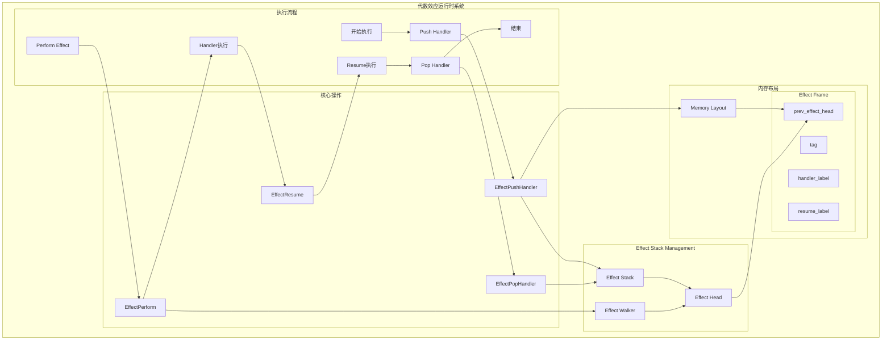
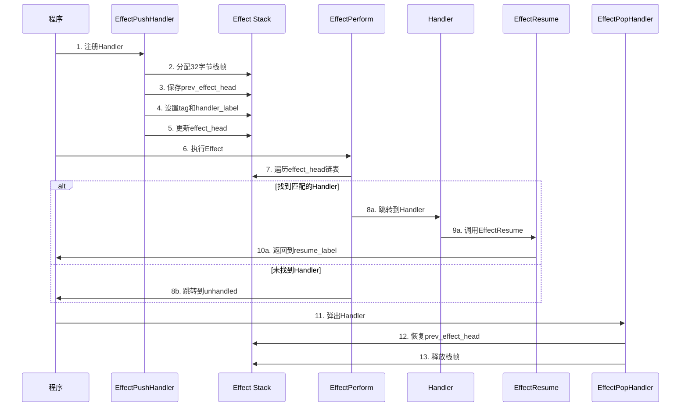
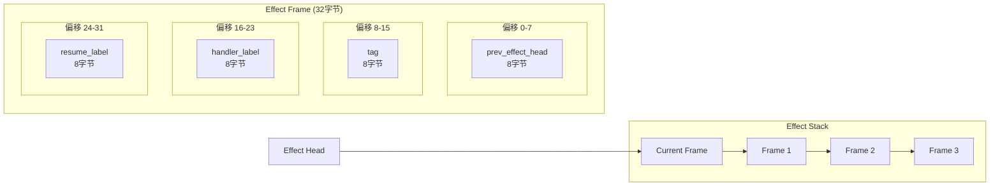
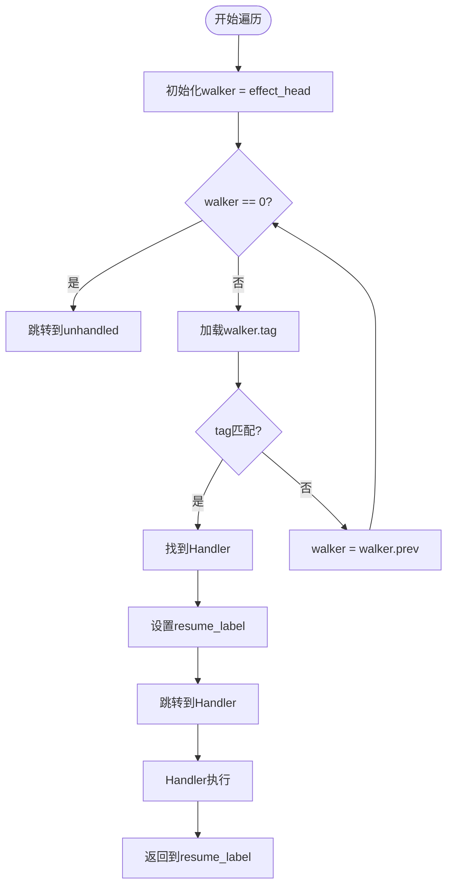

# 代数效应架构图

## 整体架构

## 详细执行流程

## 内存布局详细图

## 链表遍历逻辑

## 关键特性说明

- **单向链表结构**: 通过prev_effect_head字段构建Handler栈
- **动态标签匹配**: 支持静态和动态tag匹配
- **尾调用优化**: Handler跳转使用tail jump
- **栈帧管理**: 统一的32字节栈帧布局
- **错误处理**: 未找到Handler时的unhandled处理
